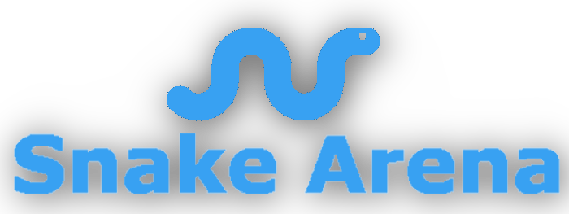

# The Polyglot
The final project for CMPT383 by Asim Shrestha.

## Topic Idea
This project is called <b>Snake Arena</b> and is inspired by [BattleSnake](https://play.battlesnake.com/), an online AI competition in which you create your own snake AI to battle other AI's. This project is a web app and serves as both a stand alone game of snake in which you battle amongst AI's and as a testing ground to build the best snake AI for future battle snake tournaments. The rules of the game and how to play may be confusing at first. Luckily, there is a tutorial modal that opens right when you visit the website! Please get a good read through of the modal prior to playing. 

### Prominent Inclusions:
- Ability to manually control a snake yourself and play against AI snakes.
- Contains pre-built snake AI's that use DFS + heuristics to most optimally survive.
- Ability to configure your own AI battlesnake through adjusting what the snake prioritizes. This can be done with the "Smart Snake" type. 
- Ability to add and remove custom and pre-built snakes onto a game.
- Ability to configure arena options such as grid size, food spawn rate, and map type.
- Leaderboard of player controlled snakes to house win / loss information.
- Lots of front end validation to mitagate error inputs.
- App logo and favicon.
- RestAPI documentation and request up due to FastAPI (See deployment section for access).

## Languages and roles
1. <b>Javascript</b>: The front end of the project and will be powered by React and React Bootstrap. This is where game creation and game configuration logic will reside. For game playing, the initial game state is created here and then passed to the socketIO backend and handled there. The front end also houses a leaderboard page generated from data retrieved through back end API requests.
2. <b>Python</b>: The back end of the project, powered by FastAPI, socketIO, and SQLAlchemy. Will host and run snake games and return results to the front end. Will also be used to persistently store snake data with SQLite. Also has a Rest API in order to create and retrieve data pertaining to the leaderboard. 
3. <b>GoLang</b>: Will house all of the AI snake algorithms and will be called through Python. Makes heavy use of Go structs. Utilizes a heuristic based depth first search algorithm to make intelligent movement decisions.

## Inter-Language communication methods
There are 3 ways in which languages communicate with each other within this app.
1. A socketIO client / server web socket connection. This is used in order to stream real time game information between the client (JavaScript) and server (Python). When a game is started, the server will place clients in their own rooms and serve them asynchronously. This means that you can have multiple tabs open and play different games concurrently without any issues. The game operates on frame intervals. At each interval, the socket server will see what the user has input if a user snake exists, figure out AI moves if AI snakes exist, and then send the updated game state back to the client. Meanwhile, the client processes the retrieved data to draw the game on screen. The client can also freely send key presses indicating the player snake movement at any time.
2. A python FastAPI REST server that integrates with SQLite in order to store data for the player snake leaderboard. Whenever a player snake finishes a multiplayer game, he is either inserted into the leaderboard or has their leaderboard values updated through the FastAPI REST server. Then when the client visits the leaderboard page, they make a get request to this server and are greeted with leaderboard information. For convenience, the SQLite database will come with pre-existing data. 
3. A foreign function interface in which GoLang code that facilitates AI snake movement algorithms will be called through the Python backend. The Go code is compiled into a shared C library in which python is able to call it through the ctypes package. In order to pass data back and forth between the two langagues, each language will both serialize game state data into a string when sending data, and deserialize data strings when recieving data.

## Deployment
This project will be deployed through the use of Docker containers. Follow instructions below to deploy.
> $`docker-compose up`

>Travel to http://localhost:3000/ on your web browser

>Travel to http://localhost:5000/ on your web browser to see the complete Rest API documentation
